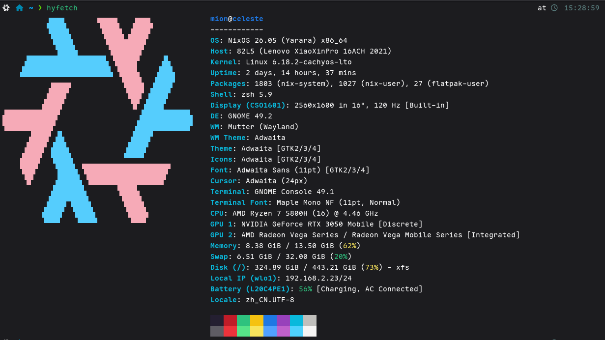
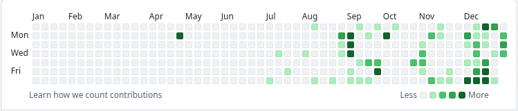
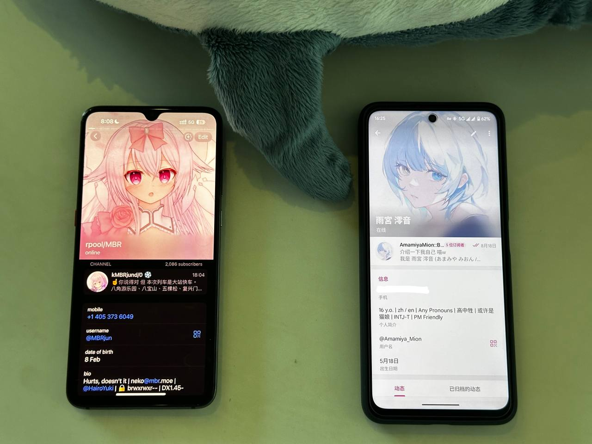
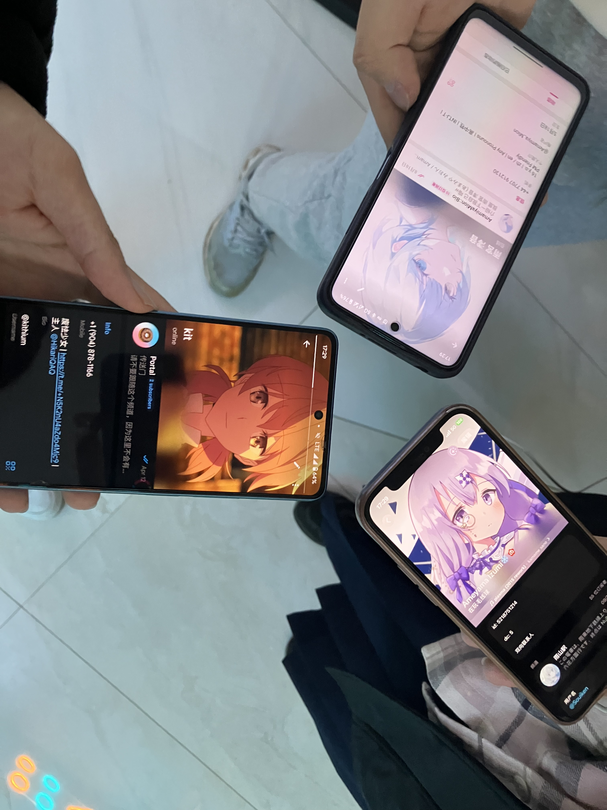
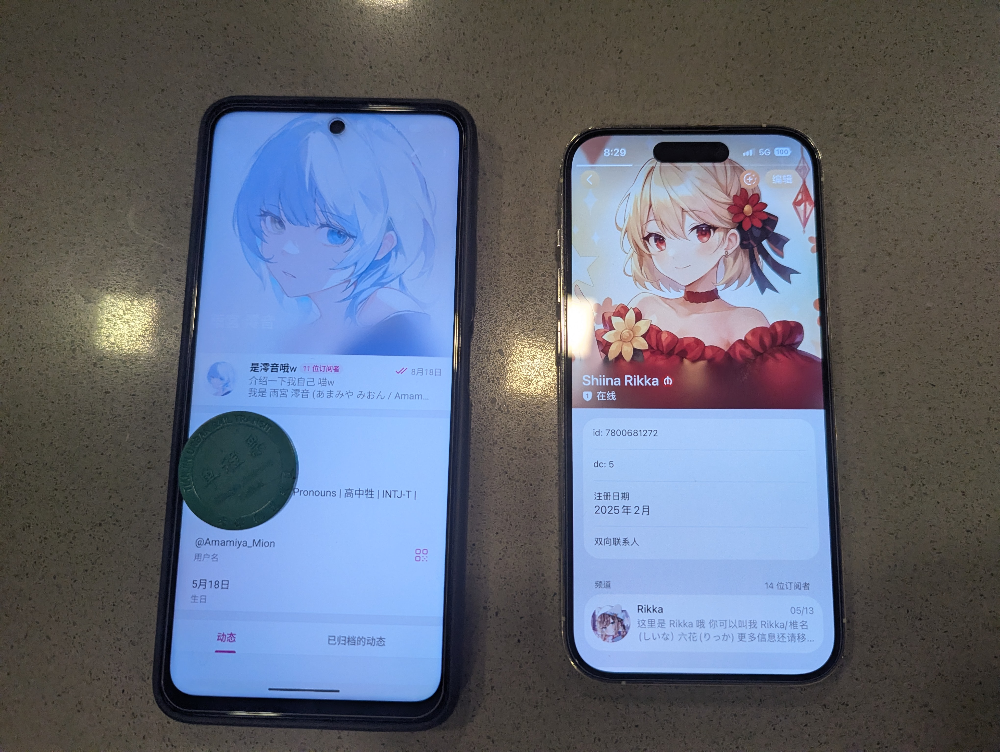
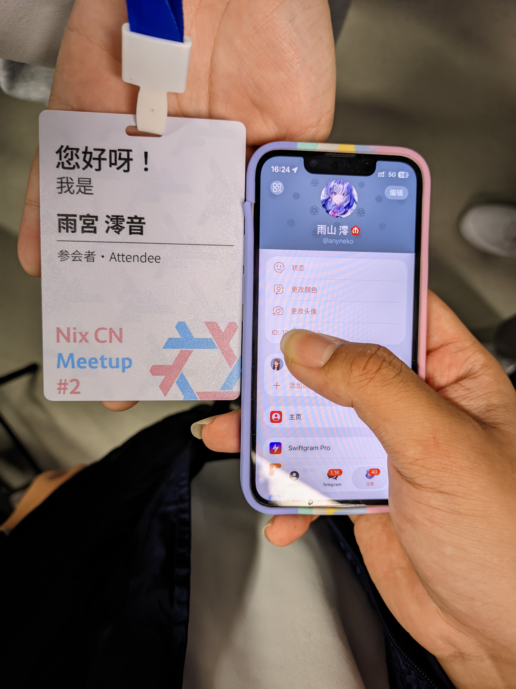
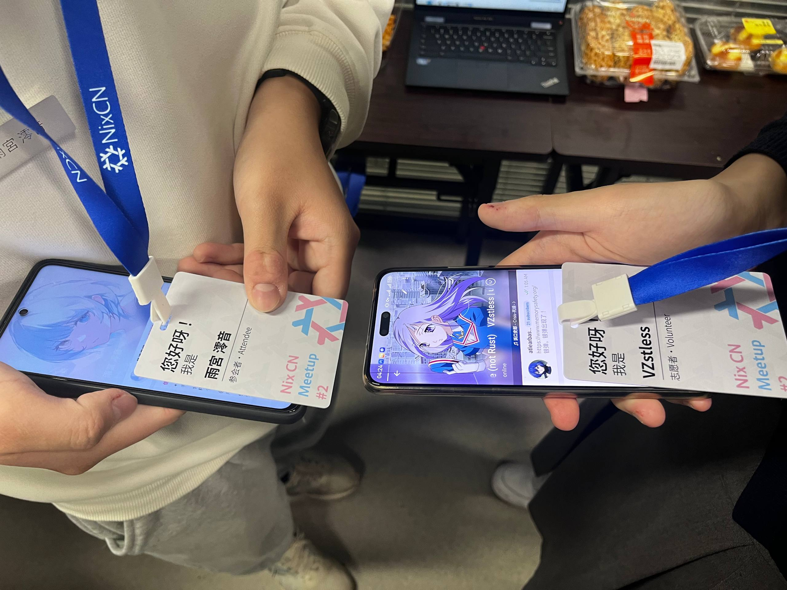
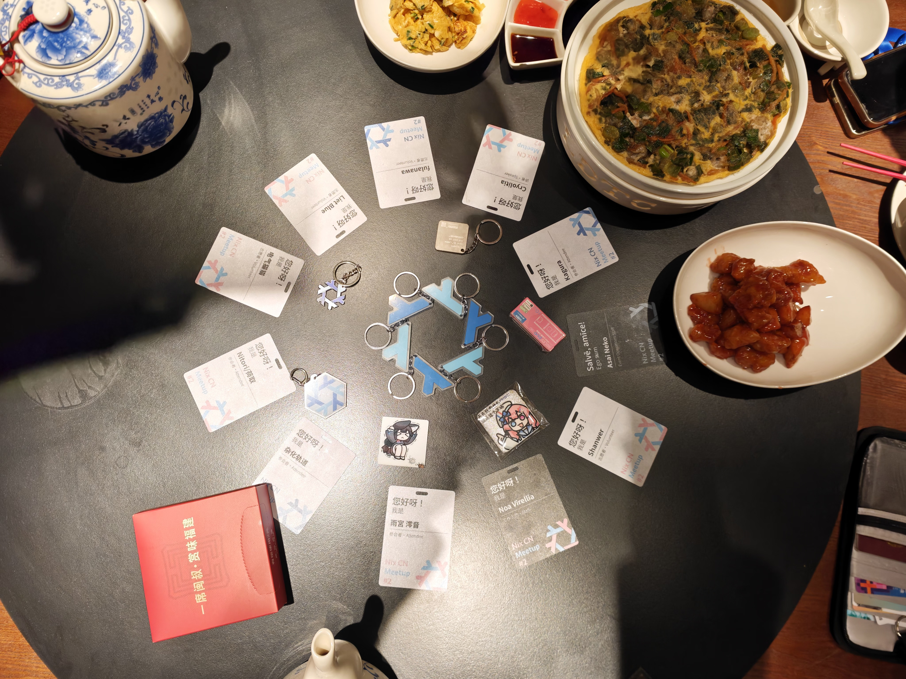
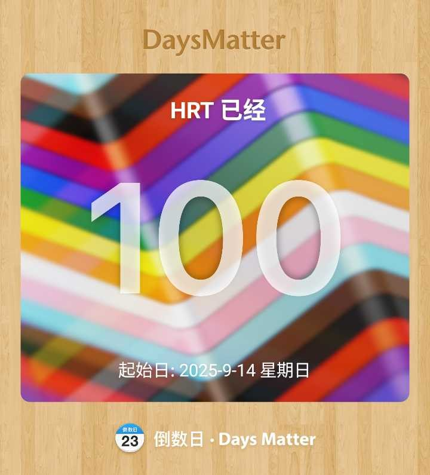

## 技术

### 重拾技术！

自从去年上了高中，我便感觉对技术的热爱就逐渐被消磨了。于是在无趣的应试学习中度过了几乎整个高一——直到今年 5 月。

5 月我忽然就想在主力机上安装 Linux（当时主力机是纯 Windows），这个从 2020 年开始一直被我热爱着的系统，于是安装了 NixOS，~~可惜当时不会写配置，过了半个多月就格式化掉，回 Windows 了~~。

我在 6 月底加入了 Telegram 上的 Linux 社群（参见下文“社交”那一节），~~于是一发不可收拾~~在 7 月中旬格式化掉了 Windows，全盘安装了我喜欢的 Gentoo Linux，~~也是当回 tech nerd 了~~，又开始折腾 Linux 和与它相关的一切，就像 2020 我刚在主力机上安装 Linux 时一样。

后来还捡起了几门学过的语言，尝试性地写了几个项目~~虽然什么都没写出来~~。

### Linux

#### Gentoo Linux

自从 2022 年第一次安装上 Gentoo Linux 开始我便一直爱着这个发行版，因为它不创人（认真的），今年学习了 Gentoo 上的打包，并[打了几个小软件](https://github.com/AmamiyaMion/mion-overlay)。Gentoo Linux 教会了我很多关于现代 Linux 系统的底层知识，我也在使用 Gentoo Linux 的过程中不断精进着我的 Linux 技术。

#### AOSC OS

今年当上了 AOSC 的 Maintainer！AOSC 作为新兴的 Linux ~~信创~~社区，十分欢迎愿意贡献的人，跟着 AOSC 的文档学打包也不算太难，~~非常推荐各位都去试试~~

~~起因还是我发现 AOSC 源里没有 `xeyes` 玩，便想打一个之后 PR 进去，然后就被通过并成为 AOSC 贡献者了~~

可惜今年没有参加 AOSCC 2025，明年一定要去！

#### NixOS

~~Nix 是黑魔法！~~

9 月和 12 月在使用 NixOS，也是逐渐见证着 NixOS 的发展~~变得越来越不创人~~，写了[自己的 config](https://github.com/AmamiyaMion/flake)，并享受着 declarative & deterministic 的快感。

~~NixOS config 非常适合刷 GitHub Commit 数，9 月 12 月用了 NixOS，GitHub 都是绿的~~

参加了 Nix CN Meetup #2 (12.27 - 12.28 上海)，应该会单独更一篇文章讲会上的故事。

### 编程

说来惭愧，今年基本什么都没做。截至现在我仍然一个项目都没有，很多语言也忘得差不多了。

学习了 Lua，并挖了学 Qt, Golang, Zig 等几个坑但一直没填。

#### Lua

7 - 8 月学习了 Lua，一门独特的语言。Lua 的很多设计巧思和轻量的特点让她成为了我最喜欢的脚本语言，~~可惜还是没用 Lua 写出项目~~

## 社交

### 发现群友！

上半年是孤独的。

6 月底的一天我在 Telegram 上找到了几个 Linux 相关的技术群并加入，自此我遇到了很多有同好的人，并逐渐加入了更多群。群友们给了我理解、支持、关爱等我很少收到的东西，支持我度过难关。在此向每一位群友表示感谢！

9 月面基了 [MBRjun](https://libmbr.com) 与 [Souiken](https://souiken.moe)，12 月初面到了 kit，月底面到了 [Shiina Rikka](https://rikka.im) 并参加了 Nix CN Meetup #2，见到了很多群友 xwx

### Nix CN Meetup #2

12.27 - 12.28 于上海。

这是我第一次自己出行，也是第一次参加技术会议，很高兴能见到一直陪伴我的人们，也很高兴能有一个讨论技术问题的机会。~~会场上的人都好可爱~~

学到了很多关于 Nix & NixOS 的知识，~~还抱到了很多人~~，开心 xwx

可惜由于时间原因没有听完 Day 2 下午的所有议程（哭

## 认识自我

### 关于精神疾病

9 月 25 日我在发疯以后自己做了人格诊断问卷 (PDQ4+)，结果是我有 边缘型、强迫型、自恋型、分裂型、抑郁型、偏执型、表演型、回避型、被动攻击型、分离型、反社会型人格障碍。

或许解释了为什么我一直是个怪人吧。

### Trans

自从 7 月开始了解到 trans 之后我就开始怀疑自己的性别。有些事情还是被压抑太久了。9 月 14 日正式开始 HRT。自己在向着自己喜欢的方向发展呢 w ~~但明年是否炸柜就不知道了~~

## 总结（？

**2025 是劳累的一年。**

升上高二以后压力大了很多，几乎没有喘息的时间，~~还要应对 sb 学校和领导~~，压力最大、心理状态最差的时候是 9 月和 10 月，至于后面两个月，可能是麻木了吧（sigh

**2025 是不平凡的一年。**

也许是命中注定，我在孤独中度过了人生前 15 年，又在今年遇到了你们，一群真正包容、友善、互相关爱的人们。Linux 将我们联接在一起。再次感谢每一位朋友的支持与关爱。

我重新发现了自己，发现了在压抑之下真实的想法和意愿，发现了我真正需要什么、真正想要什么，而不是顺从别人想要我变成什么。

我不指望我能在 20251231 -> 20260101 这一夜间发生多大改变，但我想，逐渐活成自己想要的样子，活成自己快乐的样子，做最好的自己。

一切都会慢慢变好的……吗？似乎并不会。

2026 马上就要到来了，迎接我的是高二下学期和高三，我希望我能活下去，在父母和学校的重压之下活下去。

共勉。

也祝你活下去，活出本色。

**雨宮 澪音 20251231 于天津市。**